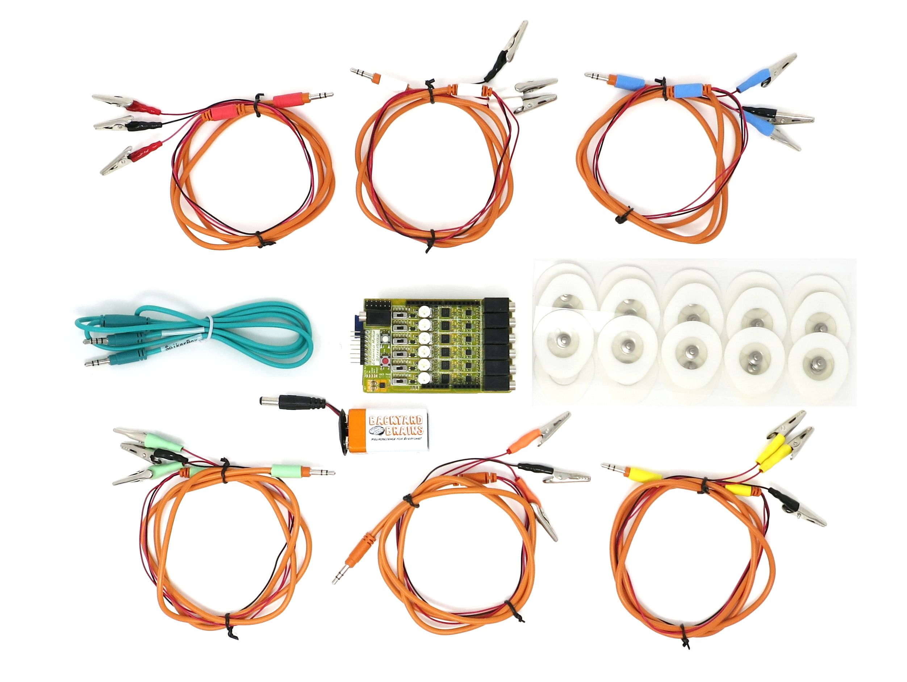
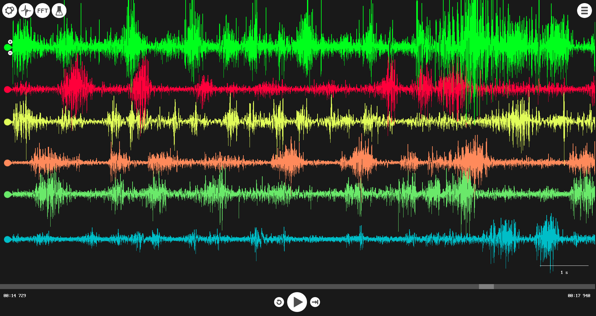
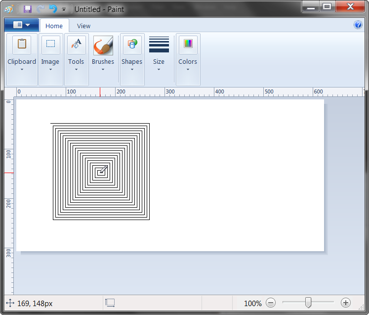
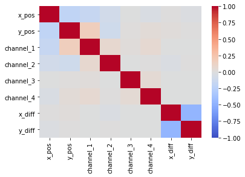
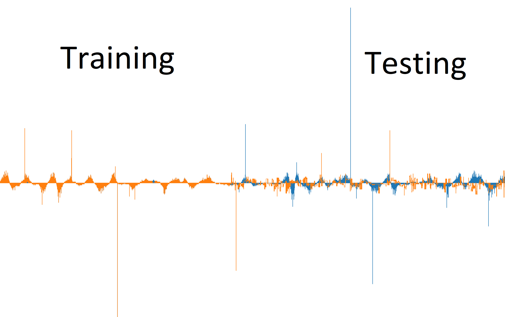

# Controlling the Mouse with EMG Signals

## Executive Summary

Many people are incapable of utilizing a conventional computer mouse, however some of those people still have some of the upper arm muscles used to move a mouse. This project aims to take EMG readings of upper arm and back muscles and use them to control a mouse. Many machine learning models (neural nets, decision trees, linear regression, etc...) evaluated on this task. Unfortunately no model provided sufficient accuracy to be usable. Next steps include exploring different muscle measurement systems, trying additional models, and attempting different ways to move the mouse that use larger and more simple muscles.

# Muscle Signal Collection

The MuscleSpikerShield Pro from Backyard Brains was used to measure muscle impulses.

---

Hardware used to collect muscle data. 
  
  ---
                                
Example Muscle Signals. 

# Mouse Position Recording
PyAutoGUI was used to record the position of the mouse.

---
Example PyAutoGUI use.

# Data Pre-Processing

Raw serial data had to be converted into four separate channels. Each frame of muscle data was signaled by a bit at the start of the first byte of the frame. The mouse position data had to be down sampled to match the sampling rate of the muscle signals. This was accomplished by recording the time of every muscle and mouse sample and matching them to create a unified dataset.

# Exploratory Data Analysis

The data collected was very simple and as such only basic correlations were examined.

# Modeling

The most successful model was a decision tree regressor.

---

Decision tree regressor predictions (orange) vs actuals (blue)

# Implementing the Controller

The muscle recording and prediction/mouse movement functions were run on separate threads to reduce latency. Because the models use a set number of lagged data to predict the next difference in mouse position the muscle data was stored in a deque. A deque allows for speed appends from either end and importantly it can have a fixed size, such that new data pushes old data out of the deque.